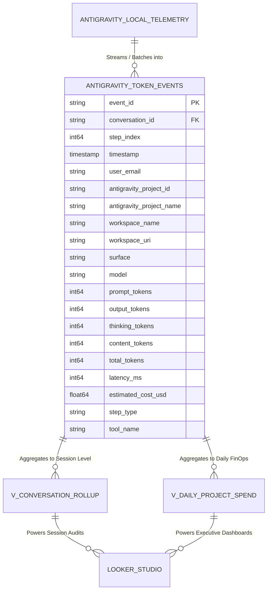

# Antigravity Token Observability Data Model Documentation

This document defines the schema, architecture, and operational design of the **Token Observability Data Model** implemented in Google BigQuery. It serves as the single source of truth for engineering, FinOps, and BI teams monitoring Antigravity AI usage across organizations.

---

## 1. Architectural Overview

The data model follows modern cloud data warehousing best practices: **a single granular, append-only Fact Table optimized for columnar storage, paired with zero-storage logical views for business intelligence.**



### Dataset Details
* **GCP Project:** `<PROJECT_ID>` (Configurable via `GCP_PROJECT`)
* **Dataset ID:** `token_analytics`
* **Location:** `US` (Multi-region)
* **Resource Label:** `datacloud:antigravity`

---

## 2. Core Fact Table: `antigravity_token_events`

Captures atomic LLM generation events and tool execution steps emitted by the Antigravity runtime.

### Data Dictionary

| Column Name | Data Type | Mode | Description | Example / Values |
| :--- | :--- | :--- | :--- | :--- |
| **`event_id`** | `STRING` | REQUIRED | Unique idempotent event identifier (UUID or hash of conversation + step). Prevents duplicate ingestion. | `evt_51b57a96_s4` |
| **`conversation_id`** | `STRING` | REQUIRED | Antigravity session UUID. Foreign key to conversation history. | `51b57a96-606a-4903-999e-e4a848b1f02d` |
| **`step_index`** | `INT64` | REQUIRED | 0-indexed execution turn number in the trajectory. | `0`, `1`, `2`, `3` |
| **`timestamp`** | `TIMESTAMP` | REQUIRED | Exact UTC timestamp of when the step completed. | `2026-09-19 01:44:00 UTC` |
| **`user_email`** | `STRING` | REQUIRED | Developer Google account / IAM principal who ran the agent session. | `developer@example.com` |
| **`antigravity_project_id`**| `STRING` | NULLABLE | Antigravity workspace project UUID. | `6318632c-42fb-44b4-ac59-510697f7078d` |
| **`antigravity_project_name`**| `STRING` | NULLABLE | Human-readable project name mapped from config. | `token_observability`, `Project_4` |
| **`workspace_name`** | `STRING` | NULLABLE | Base folder name of the local repository. | `token_observability` |
| **`workspace_uri`** | `STRING` | NULLABLE | Fully-qualified file URI to the local repository root. | `file:///path/to/workspace` |
| **`surface`** | `STRING` | NULLABLE | Interface through which the session was run. | `app` (Desktop 2.0), `ide` (VS Code), `cli` (`agy`) |
| **`model`** | `STRING` | REQUIRED | Model name or identifier serving the request. | `gemini-3.8-flash`, `claude-3.7-sonnet` |
| **`prompt_tokens`** | `INT64` | REQUIRED | Cumulative input context size (system prompt + history + tool outputs). | `27850` |
| **`output_tokens`** | `INT64` | REQUIRED | Total candidate tokens generated by the model in this step. | `1760` |
| **`thinking_tokens`** | `INT64` | NULLABLE | Tokens consumed by internal reasoning / thought blocks. | `749` |
| **`content_tokens`** | `INT64` | NULLABLE | Visible response tokens delivered to user / tool dispatcher. | `1011` |
| **`total_tokens`** | `INT64` | REQUIRED | Combined tokens (`prompt_tokens + output_tokens`). | `29610` |
| **`latency_ms`** | `INT64` | NULLABLE | Turn roundtrip time in milliseconds. | `1420` |
| **`estimated_cost_usd`**| `FLOAT64` | NULLABLE | Computed dollar cost based on model pricing rate cards. | `0.00312` |
| **`step_type`** | `STRING` | NULLABLE | Antigravity step classification. | `PLANNER_RESPONSE`, `TOOL_EXECUTION` |
| **`tool_name`** | `STRING` | NULLABLE | Name of tool called (if step is a tool invocation). | `search_web`, `run_command`, `view_file` |

---

## 3. Storage Optimization & FinOps Design

### A. Time-Unit Partitioning
* **Partition Specification:** `PARTITION BY DATE(timestamp)`
* **Rationale:** Queries in Looker Studio and BI tools almost always filter by date ranges (e.g., *"Past 7 Days"*, *"Last Month"*). BigQuery skips unselected date partitions entirely, reducing query processing costs by up to **95%**.

### B. Multi-Dimensional Clustering
* **Clustering Specification:** `CLUSTER BY antigravity_project_name, model, user_email, conversation_id`
* **Rationale:**
  1. `antigravity_project_name`: Enables instantaneous slicing across company repositories.
  2. `model`: Isolates cost drivers between lightweight flash models and expensive reasoning models.
  3. `user_email`: Powers developer-specific audits and team leaderboards.
  4. `conversation_id`: Colocates all turns of a single conversation on disk, enabling lightning-fast trajectory rendering.

---

## 4. Analytical Views (Logical Layer)

These views provide aggregated business metrics with **zero duplicated storage cost**.

### View 1: `v_conversation_rollup`
Aggregates granular steps into a single record per conversation session.

```sql
CREATE OR REPLACE VIEW `<PROJECT_ID>.token_analytics.v_conversation_rollup` AS
SELECT
  conversation_id,
  user_email,
  antigravity_project_name,
  workspace_name,
  MIN(timestamp) AS session_start,
  MAX(timestamp) AS session_end,
  COUNT(DISTINCT step_index) AS total_turns,
  ANY_VALUE(model) AS primary_model,
  SUM(prompt_tokens) AS total_prompt_tokens,
  SUM(output_tokens) AS total_output_tokens,
  SUM(COALESCE(thinking_tokens, 0)) AS total_thinking_tokens,
  SUM(total_tokens) AS grand_total_tokens,
  MAX(prompt_tokens) AS max_context_window_reached,
  ROUND(SUM(estimated_cost_usd), 4) AS session_cost_usd
FROM `<PROJECT_ID>.token_analytics.antigravity_token_events`
GROUP BY conversation_id, user_email, antigravity_project_name, workspace_name;
```

#### Key Metrics Provided:
* **`total_turns`**: Total conversational cycles in the session.
* **`max_context_window_reached`**: Peak input context bloat. Highlights runaway prompt bloat caused by reading massive log files or directories.
* **`session_cost_usd`**: End-to-end dollar cost of the task.

---

### View 2: `v_daily_project_spend`
Rolls up token burn by date, project, and model for executive FinOps dashboards.

```sql
CREATE OR REPLACE VIEW `<PROJECT_ID>.token_analytics.v_daily_project_spend` AS
SELECT
  DATE(timestamp) AS usage_date,
  antigravity_project_name,
  model,
  COUNT(DISTINCT conversation_id) AS active_conversations,
  COUNT(DISTINCT user_email) AS active_developers,
  SUM(prompt_tokens) AS daily_prompt_tokens,
  SUM(output_tokens) AS daily_output_tokens,
  SUM(COALESCE(thinking_tokens, 0)) AS daily_thinking_tokens,
  SUM(total_tokens) AS daily_total_tokens,
  ROUND(SUM(estimated_cost_usd), 4) AS daily_spend_usd
FROM `<PROJECT_ID>.token_analytics.antigravity_token_events`
GROUP BY usage_date, antigravity_project_name, model;
```

#### Key Metrics Provided:
* **`active_conversations` & `active_developers`**: Measures developer adoption and concurrent agentic load.
* **`daily_thinking_tokens`**: Tracks reasoning overhead vs productive output tokens.
* **`daily_spend_usd`**: Day-by-day expenditure for cost forecasting.

---

## 5. Source-to-Target Ingestion Mapping

How data maps from the developer's local Antigravity environment to the BigQuery table:

| BigQuery Destination Field | Antigravity Local Source | Extraction Method |
| :--- | :--- | :--- |
| `conversation_id` | Filename / DB path | `~/.gemini/antigravity/conversations/<id>.db` |
| `step_index` | `steps.idx` | Direct integer column in SQLite |
| `timestamp` | `steps.metadata` (Field 1 protobuf) | Decoded varint timestamp (seconds + nanos) |
| `prompt_tokens` | `steps.metadata` (Field 9.2 protobuf) | Exact Gemini prompt tokens |
| `output_tokens` | `steps.metadata` (Field 9.3 protobuf) | Exact Gemini candidate tokens |
| `thinking_tokens` | `steps.metadata` (Field 9.9 protobuf) | Gemini reasoning tokens |
| `content_tokens` | `steps.metadata` (Field 9.10 protobuf) | Gemini visible content tokens |
| `model` | `steps.metadata` (Field 11 protobuf) or transcript | Model enum / identifier string |
| `antigravity_project_id` | `trajectory_metadata_blob` | Extracted Project UUID |
| `antigravity_project_name`| `~/.gemini/config/projects/<id>.json` | Matched on `id` -> `name` |
| `workspace_uri` | `trajectory_metadata_blob` | Extracted folder URI |
| `user_email` | Client environment | `gcloud config get-value account` or git email |

---

## 6. Looker Studio Integration Guide

To connect Looker Studio to this data model:

1. Open **[Looker Studio](https://lookerstudio.google.com/)**.
2. Click **Create** > **Data Source** > Select **BigQuery**.
3. Choose:
   * **Project:** `<PROJECT_ID>`
   * **Dataset:** `token_analytics`
   * **Table:** `antigravity_token_events` (for granular reports) or `v_daily_project_spend` (for executive summary).
4. Recommended Visualizations:
   * **Scorecards:** `SUM(total_tokens)`, `SUM(estimated_cost_usd)`, `COUNT_DISTINCT(conversation_id)`.
   * **Time-Series Chart:** Dimension: `DATE(timestamp)`, Metrics: `prompt_tokens`, `thinking_tokens`, `output_tokens`.
   * **Breakdown Bar Chart:** Dimension: `antigravity_project_name`, Metric: `estimated_cost_usd`.
   * **Interactive Filters (Dropdowns):** `workspace_name`, `model`, `user_email`, `antigravity_project_name`.
